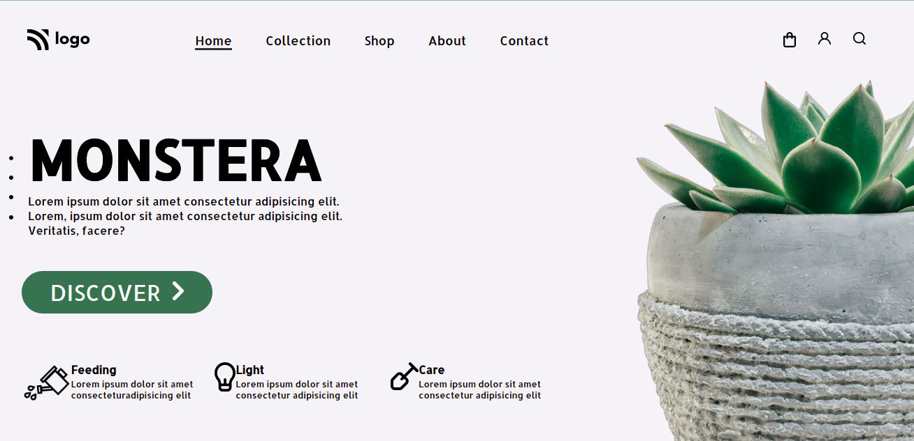

# Project-6

- In making this website, adjusting all the texts,image and icons were a bit difficult but it was fun making this project.This project is made with HTML and CSS.

- It took me 1-2hrs to make this project.Please find the project link below:

---

## Screenshot

---

## 🛠 Skills learned

HTML, CSS

---

## 🚀 About Me

### Hey, I am Yasir lambawala

- I am born and brought up in Vadodara, Gujarat. I have done my Btech at GTU university and I am currently learning Web-development.

---

## Feedback

- If you have any feedback, please reach me at lambawalay@gmail.com
